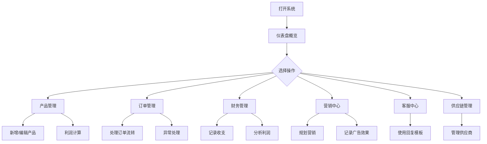

## 1. 产品概述
POD宠物纪念周边跨境电商运营管理系统——为单人独立运营的POD（按需生产）跨境电商业务提供全流程数字化管理工具，覆盖选品设计、订单跟踪、财务核算、营销推广、客服模板、供应链管理等核心环节，实现轻资产模式下的高效单人运营。

## 2. 核心功能

### 2.1 用户角色
| 角色 | 注册方式 | 核心权限 |
|------|----------|----------|
| 店主（单人运营者） | 本地初始化 | 全部功能权限 |

### 2.2 功能模块
1. **仪表盘页**：关键指标概览（今日订单、本月营收、利润率、库存预警）、快捷操作入口、阶段目标进度
2. **产品管理页**：产品品类管理、设计模板库、利润计算器、上架状态追踪
3. **订单管理页**：订单列表与详情、状态流转（待生产→生产中→已发货→已完成）、异常订单处理
4. **财务管理页**：成本记录、营收统计、利润分析图表、预算分配追踪
5. **营销中心页**：营销日历、内容模板库、广告投放记录、效果分析
6. **客服中心页**：常见问题模板、客户沟通记录、评价管理
7. **供应链管理页**：供应商信息、合作状态、质量评估、物流追踪

### 2.3 页面详情
| 页面名称 | 模块名称 | 功能描述 |
|----------|----------|----------|
| 仪表盘 | 关键指标卡片 | 展示今日订单数、本月营收、毛利率、待处理订单等核心指标 |
| 仪表盘 | 阶段目标进度 | 展示项目4个阶段的完成进度和当前里程碑 |
| 仪表盘 | 快捷操作 | 新增产品、新增订单、快速记账等一键操作入口 |
| 产品管理 | 品类列表 | 展示宠物T恤、马克杯、钥匙扣等品类的成本、售价、利润率 |
| 产品管理 | 利润计算器 | 输入成本和售价，自动计算利润率、盈亏平衡点 |
| 产品管理 | 设计模板 | 管理AI设计模板，标记版权合规状态 |
| 订单管理 | 订单列表 | 按状态筛选订单，展示订单号、客户、产品、金额、状态 |
| 订单管理 | 订单详情 | 展示订单完整信息，支持状态流转操作 |
| 财务管理 | 收支记录 | 记录每笔收入和支出，自动分类 |
| 财务管理 | 利润分析 | 按日/周/月展示营收、成本、利润趋势图 |
| 财务管理 | 预算追踪 | 展示1万元启动资金的分配和消耗情况 |
| 营销中心 | 营销日历 | 按时间线展示营销计划和节日营销节点 |
| 营销中心 | 广告记录 | 记录广告投放金额、渠道、效果数据 |
| 客服中心 | 模板库 | 中英文客服回复模板，一键复制 |
| 客服中心 | 评价管理 | 查看和管理客户评价，标记需跟进项 |
| 供应链管理 | 供应商列表 | 展示供应商信息、合作状态、评分 |
| 供应链管理 | 物流追踪 | 查询在途订单的物流状态 |

## 3. 核心流程

用户打开系统后，首先通过仪表盘了解业务全局状态。日常运营中，通过产品管理新增和维护产品，通过订单管理处理订单流转，通过财务管理记录收支和分析利润，通过营销中心规划推广活动，通过客服中心管理客户沟通，通过供应链管理维护供应商关系。

## 4. 用户界面设计

### 4.1 设计风格
- 主色调：深墨绿色（#1B4332）+ 暖金色（#D4A574），传达专业稳重与温暖关怀的品牌调性
- 辅助色：柔和米白（#FAF8F5）作为背景，浅灰绿（#E8F0E8）作为卡片背景
- 按钮风格：圆角矩形（rounded-lg），主按钮深墨绿底白字，次按钮描边风格
- 字体：标题使用 Playfair Display，正文使用 Noto Sans SC
- 布局风格：左侧固定导航栏 + 右侧内容区，卡片式布局
- 图标风格：使用 lucide-react 图标库，线性风格

### 4.2 页面设计概览
| 页面名称 | 模块名称 | UI元素 |
|----------|----------|--------|
| 仪表盘 | 指标卡片 | 4列网格，每卡片含图标+数值+趋势箭头，悬停放大效果 |
| 仪表盘 | 阶段进度 | 横向进度条，4阶段节点，当前阶段高亮动画 |
| 产品管理 | 品类表格 | 条纹表格，行悬停高亮，状态标签彩色胶囊 |
| 订单管理 | 订单卡片 | 卡片列表，左侧状态色条，右侧操作按钮组 |
| 财务管理 | 图表区 | 面积图展示趋势，柱状图展示对比 |
| 营销中心 | 日历 | 月视图日历，事件彩色圆点标记 |
| 客服中心 | 模板列表 | 可搜索列表，一键复制按钮，语言标签 |

### 4.3 响应式设计
- 桌面优先设计，适配1280px及以上屏幕
- 导航栏在小屏下收缩为图标模式
- 卡片网格在小屏下从4列变为2列再变为1列

### 4.4 动效设计
- 页面切换：淡入淡出过渡（200ms）
- 卡片悬停：轻微上浮+阴影增强
- 数据加载：骨架屏占位动画
- 进度条：填充动画（800ms ease-out）
- 新增数据：从上方滑入动画
