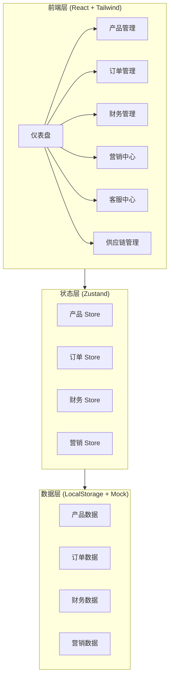
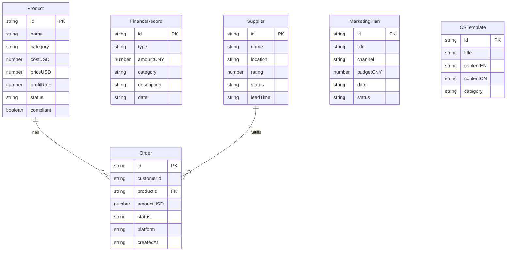

## 1. 架构设计

## 2. 技术说明
- 前端：React@18 + TailwindCSS@3 + Vite
- 初始化工具：vite-init
- 后端：无（纯前端，数据存储在 LocalStorage）
- 状态管理：Zustand
- 图表库：Recharts
- 路由：React Router DOM
- 图标：lucide-react

## 3. 路由定义
| 路由 | 用途 |
|------|------|
| / | 仪表盘，展示核心指标概览 |
| /products | 产品管理，品类列表与利润计算 |
| /orders | 订单管理，订单列表与状态流转 |
| /finance | 财务管理，收支记录与利润分析 |
| /marketing | 营销中心，营销日历与广告记录 |
| /customer-service | 客服中心，回复模板与评价管理 |
| /supply-chain | 供应链管理，供应商与物流追踪 |

## 4. API定义
本项目为纯前端应用，无需后端API。数据通过Zustand Store管理，持久化到LocalStorage。

## 5. 数据模型

### 5.1 数据模型定义

### 5.2 初始数据定义

产品初始数据：
- 宠物肖像T恤：成本$10，售价$40，利润率75%
- 宠物纪念马克杯：成本$6，售价$28，利润率78.6%
- 宠物钥匙扣：成本$4，售价$18，利润率77.8%
- 宠物装饰画：成本$16，售价$65，利润率75.4%
- 宠物纪念相框：成本$14，售价$50，利润率72%

供应商初始数据：
- Printify（国际）：美国，评分4.5，支持多平台对接
- FBB海外仓（国内）：中国福建，评分4.3，中文服务友好
- 泉州本地工厂：中国福建，评分4.0，成本最低

客服模板初始数据：
- 订单确认通知（中/英）
- 定制流程说明（中/英）
- 发货通知（中/英）
- 退换货政策（中/英）
